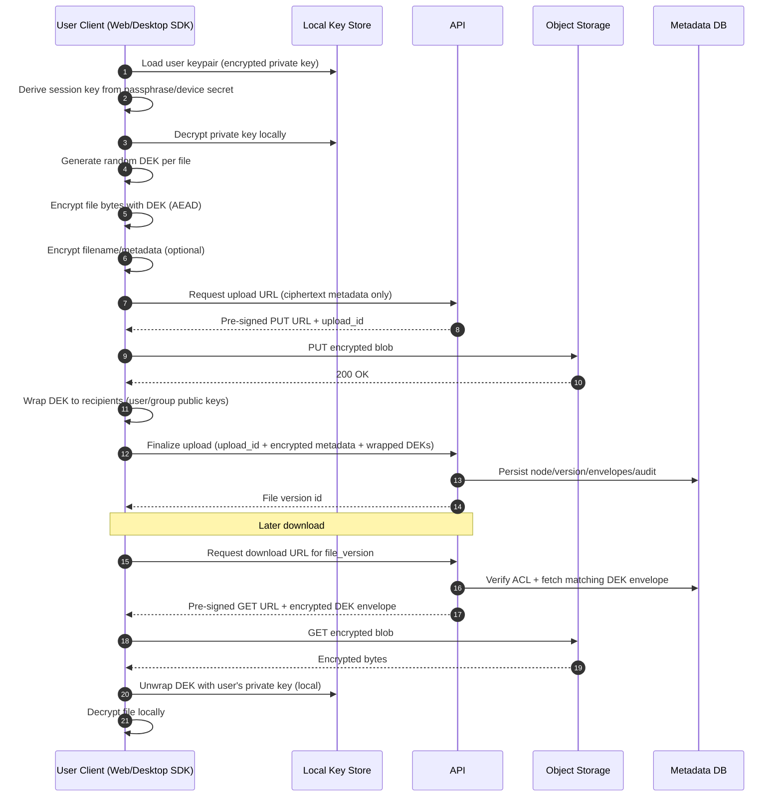

# Reference Crypto Flow Diagram

## Upload and Share Flow (Zero-Knowledge)

## Implementation Notes

- Use authenticated encryption only (AES-256-GCM or XChaCha20-Poly1305).
- Generate unique nonce/IV per encryption operation.
- Bind tenant + file identifiers as AEAD associated data.
- Never send plaintext DEK, private keys, or file bytes to API.
- Envelope recipients should include owner and any active share principals.
- Re-key by generating a new DEK and version when revoking broad access.
