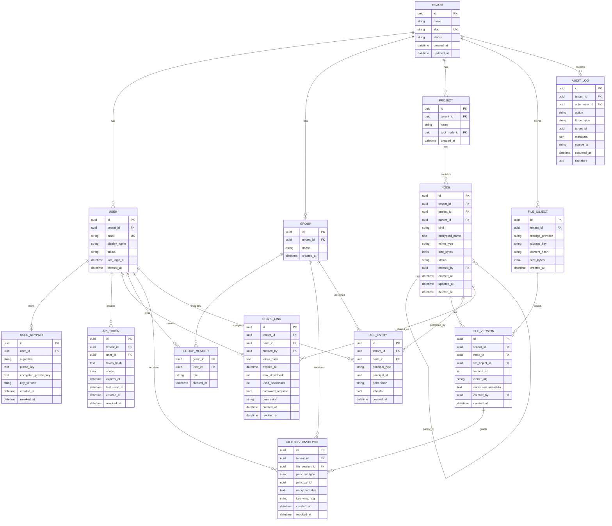

# ERD and Data Model (Multi-Tenant Zero-Knowledge DMS)

## ERD

## Notes

- `NODE.kind` is `folder` or `file`; only `file` nodes have versions.
- `FILE_OBJECT` is immutable blob storage metadata; multiple versions can deduplicate by `content_hash`.
- `FILE_KEY_ENVELOPE` supports user- and group-based key grants.
- `encrypted_name` enables encrypted filename support with server-side opaque metadata.
- Tenant isolation should be enforced in every query by `tenant_id`.
